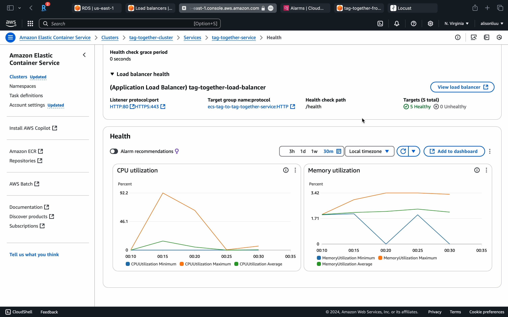

# TagTogether

TagTogether is a cloud-based service designed to support a marketing campaign. The system includes essential modules and databases for user registration and login, event registration, post uploads, and dynamic leaderboard updates.

## Project Overview

This project consists of a backend service built with FastAPI and a frontend application using React, Tailwind and Vite, integrating Postgres as Database, and eventually deploy on AWS.

## Frontend

### Setup

1. **Install Dependencies**: Run the following command to install the necessary packages.

   ```bash
   npm install
   ```

2. **Environment Configuration**: Create a `.env` file in the `frontend` directory with the following content:

   ```plaintext
   VITE_BACKEND_URL=<your_backend_url>
   ```

   Adjust the `VITE_BACKEND_URL` to point to your backend service URL.

3. **Run Development Server**: Start the development server with:

   ```bash
   npm run dev
   ```

## Backend

### Setup

1. **Environment Configuration**: Create a `.env` file in the `backend` directory with the following content:

   ```plaintext
   POSTGRES_USER=<user>
   POSTGRES_PASSWORD=<password>
   POSTGRES_DB=mydb

   # Writer endpoint
   DATABASE_URL_WRITER=<writer_instance_url>

   # Reader endpoint
   DATABASE_URL_READER=<reader_instance_url>

   SECRET_KEY=your_secret_key
   ```

   - **Writer Endpoint**: Used for operations that modify the database, such as creating or updating records.
   - **Reader Endpoint**: Used for operations that only read from the database, optimizing read performance.

2. **Run with Docker**: Use Docker Compose to build and run the backend services:

   ```bash
   docker-compose up --build
   ```

   This command will start the FastAPI application and connect to the specified PostgreSQL databases.

## Testing

### Load Testing

Use Locust to perform load testing and simulate user interactions:

1. **Start Locust**: Run the following command:

   ```bash
   locust -f test/load_test.py --host=<your_backend_url>
   ```

2. **Access Locust Web Interface**: Open a browser and go to `http://localhost:8089` to start the test and monitor the results.

#### Load Test Design

The `load_test.py` script is designed to simulate the competition process with varying user behaviors over time (Based on Probability):

- **Early Phase**: Simulates initial user registration, team creation, and moderate check-in activity.
- **Mid Phase**: Increases the frequency of user check-ins while maintaining team-related activities.
- **Final Phase**: Significantly increases the check-in activity to simulate a rush towards the end of the competition.
- **Post-Final Phase**: Exponentially increases check-in requests to stress test the system under peak load conditions.

## Deployment and Testing Result

We deploy the backend on AWS and run the load test on AWS. We ran the load test for 140 seconds to simulate peak load of 1100 users. 

We found that the system starting with 4 instances would scale out to the maximum of 8 instances(our setting) at the end of the test. However, AWS start new instances slower than GCP which leads to a longer delay in the test. There is a time our service is not able to handle the request and the response time is high. Fortunately, once the new instances are ready, the system can handle the request. We can also see the CPU usage is high and then fall down after the new instances are ready. 

The result is shown in the following plot:



## Future Work

- **Improvement of the Load Test**: We can improve the load test by extending the test time and improve the system's scalability.
- **Try to deploy on GCP**: We can try to deploy on GCP to see if it can improve the system's capability of handling the load.

## Additional Information

This project is designed to be a robust and scalable solution for managing marketing campaigns, with a focus on ease of use and extensibility. The backend efficiently uses separate database connections for reading and writing to optimize performance and scalability.
